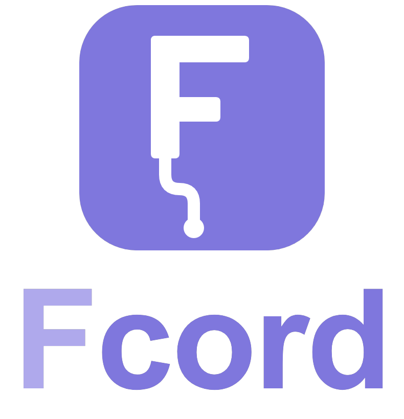

  

  A customizable Discord desktop client mod for Windows, with hundreds of plugins and FCord-exclusive features. 
  Developed and maintained by <strong>Fahd (<a href="https://github.com/ellecrydansmesdm">@ellecrydansmesdm</a>)</strong>.

  
  
  

---

## About

FCord extends the official Discord desktop app with a large plugin catalog, themes, profile customization, account tools, media controls, and optional cloud synchronization. You can manage the available features from the FCord settings page and disable the ones you do not need.

FCord is developed and maintained by Fahd ([@ellecrydansmesdm](https://github.com/ellecrydansmesdm)).

## Features

- **Hundreds of included plugins.** Customize chat, appearance, notifications, servers, voice, media, privacy, and shortcuts.
- **Themes and profiles.** Use QuickCSS, local themes, the theme library, and FCord profile options for banners, badges, decorations, effects, and bios.
- **Account and privacy tools.** Manage additional account sessions and protect account data saved on your computer with FCord's encrypted storage.
- **Voice and media tools.** Access voice utilities, integrated players, recording tools, SoundPad, and desktop media features from Discord.
- **Backup and synchronization.** Export settings locally or use the optional cloud service to synchronize settings, QuickCSS, and FCord profiles.
- **Built-in updates.** Install published FCord updates from the client and restart Discord to load the new desktop bundle.

Some plugins use external services, additional Discord accounts, or audio devices and require their own setup. Plugin availability and compatibility can change when Discord updates its desktop client.

## Installation

FCord supports **Windows x64** with Discord **Stable, PTB, and Canary**.

1. Install and open your preferred Discord desktop channel at least once.
2. Download [FCord-Installer.exe](https://github.com/ellecrydansmesdm/Fcord/releases/latest/download/FCord-Installer.exe).
3. Close Discord and run the installer.
4. Select the Discord installations you want to modify, then install FCord.
5. Start Discord and open **User Settings → FCord**.

Discord updates can replace the application directory used by FCord. Run the latest installer again if FCord disappears after a Discord update.

## Updating and uninstalling

Use the updater in FCord settings when an update is available. Restart Discord after the update finishes.

To remove FCord, run the installer again and choose **Uninstall**. The installer removes the FCord loader and restores Discord's backed-up application archive when available.

## Security and Privacy

FCord is built with strong security boundaries and privacy-first engineering:

- **Hardware-Backed Encryption**: Tokens, credentials, and sensitive configurations are secured locally using Windows DPAPI and Electron `safeStorage`. Plaintext credentials never touch disk storage unencrypted.
- **Process & Storage Isolation**: Multi-account sessions run with separated local cache boundaries, avoiding token cross-contamination between accounts or client channels (Stable, PTB, Canary).
- **Anti-Log & Telemetry Control**: Built-in options to block tracking endpoints, mute unwanted typing indicators, and silently remove sent messages with zero trace in remote loggers.
- **Offline Reliability**: The installer and updater payloads run self-contained without downloading uncontrolled third-party scripts at runtime.

## Support

- Join the [FCord community](https://discord.gg/W2YgEStqJ4) for help and discussion.
- Report reproducible problems through [GitHub Issues](https://github.com/ellecrydansmesdm/Fcord/issues).
- Include your Discord channel, FCord version, and relevant logs when reporting a bug. Do not share account tokens or credentials.

## Credits and license

FCord is created and maintained by Fahd ([@ellecrydansmesdm](https://github.com/ellecrydansmesdm)).

The main repository uses the [GNU General Public License v3.0 or later](./LICENSE). Individual components retain their original copyright notices and licenses.

## Disclaimer

FCord is an independent project and has no affiliation with Discord Inc. Client modifications may conflict with Discord's Terms of Service, and Discord updates can break compatibility. You use FCord at your own risk. Discord and related marks belong to their respective owners.
