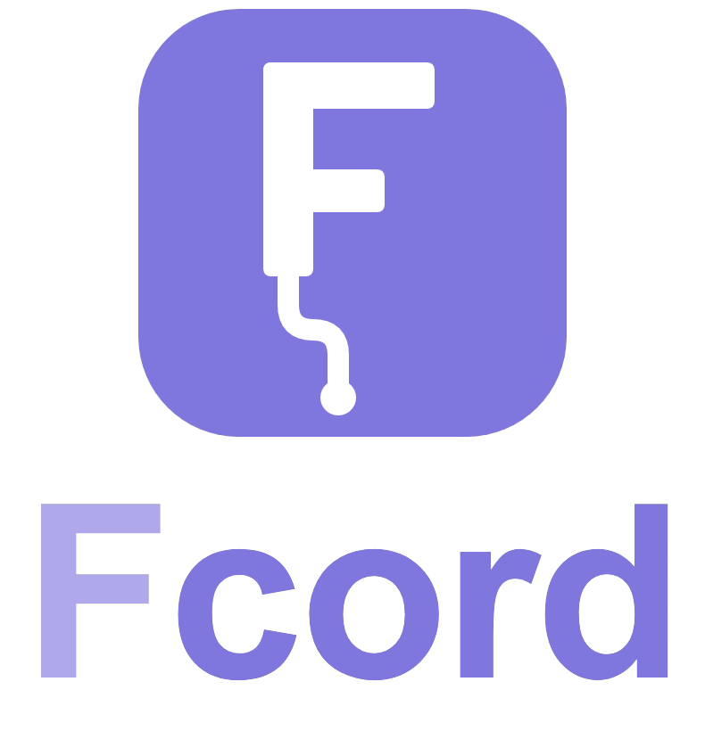

<p align="center">
  <a href="https://fhubcore.dev/" target="_blank">
    
  </a>
</p>

<h1 align="center">FCord</h1>

<p align="center">
  <strong>The modular, high-performance Discord client mod with native cross-platform support.</strong><br>
  Built-in plugin catalog • Custom themes & profiles • SoundCloud streaming engine • Hardware-backed vault security<br>
  Developed and maintained by <strong>Fahd (<a href="https://github.com/ellecrydansmesdm">@ellecrydansmesdm</a>)</strong>
</p>

<p align="center">
  <a href="https://github.com/ellecrydansmesdm/Fcord/releases/latest">
    
  </a>
  <a href="https://fhubcore.dev/" target="_blank">
    
  </a>
  <a href="https://discord.gg/W2YgEStqJ4" target="_blank">
    
  </a>
  
</p>

<p align="center">
  <a href="https://github.com/ellecrydansmesdm/Fcord/releases/latest/download/FCord-Installer-Online-win-x64.exe">
    
  </a>
  <a href="https://github.com/ellecrydansmesdm/Fcord/releases/latest/download/FCord-Installer-Offline-win-x64.exe">
    
  </a>
  <a href="https://github.com/ellecrydansmesdm/Fcord/releases/latest/download/FCord-Installer-macOS-universal.dmg">
    
  </a>
  <a href="https://github.com/ellecrydansmesdm/Fcord/releases/latest/download/FCord-Installer-Linux-x64.AppImage">
    
  </a>
  <a href="https://github.com/ellecrydansmesdm/Fcord/releases/latest/download/extension-chrome.zip">
    
  </a>
  <a href="https://github.com/ellecrydansmesdm/Fcord/releases/latest/download/extension-firefox.zip">
    
  </a>
  <a href="https://github.com/ellecrydansmesdm/Fcord/releases/latest/download/FCord.user.js">
    
  </a>
</p>

> [!TIP]
> **Cross-Platform Distribution (v1.1.1)**: FCord supports **Windows (x64 & ARM64 via Prism emulation)**, **macOS (Universal, Apple Silicon & Intel)**, **Linux (x64 AppImage & tar.gz)**, and **Discord Web (Chromium, Firefox, UserScript)**.  
> Unsigned community binaries may trigger **Windows SmartScreen / SAC** or **macOS Gatekeeper**. Check the [Quick Installation Guide](#installation) below for 1-click execution steps.

---

## About

FCord extends the official Discord desktop and web clients with an extensive plugin catalogue, custom CSS styling, custom profile personalization, multi-account isolation, integrated media playback, and cloud synchronization. Every feature can be independently toggled and configured through the client settings.

FCord is developed and maintained by Fahd ([@ellecrydansmesdm](https://github.com/ellecrydansmesdm)).

## Features

- **Extensive Plugin Catalogue**: Configure chat enhancements, notification filters, server utilities, voice tools, privacy controls, and shortcuts.
- **Themes and Profiles**: Apply QuickCSS, custom local stylesheets, theme links, and per-account profile cosmetics (custom badges, effects, bios, and banners).
- **Account Isolation & DPAPI Vault**: Switch accounts seamlessly via the Discord UI. Account credentials and tokens are secured locally via Windows DPAPI and Electron `safeStorage`.
- **Integrated Voice & Media Tools**: In-call SoundPad with peer voice transmission, audio ducking prevention, microphone passthrough, and SoundCloud streaming.
- **Backup & Cloud Synchronization**: Export configurations locally or synchronize settings, custom profiles, and QuickCSS via optional backend sync.
- **In-Client Atomic Updates**: Update published releases directly from the client notification banner with automatic directory swapping and rollback protection.

---

## Downloads & Distribution Matrix

All release binaries and packages are compiled, cryptographically hashed, and attached to the [GitHub Releases](https://github.com/ellecrydansmesdm/Fcord/releases/latest) page:

| Platform / Target | Architecture | Format | Download Link | Size | Description |
| :--- | :---: | :---: | :--- | :---: | :--- |
| **Windows** (Recommended) | x64 | `.exe` | [**FCord-Installer-Online-win-x64.exe**](https://github.com/ellecrydansmesdm/Fcord/releases/latest/download/FCord-Installer-Online-win-x64.exe) | ~106 MB | Lightweight online installer. Downloads and stages runtime payload on demand. |
| **Windows** (Offline / Airgap) | x64 | `.exe` | [**FCord-Installer-Offline-win-x64.exe**](https://github.com/ellecrydansmesdm/Fcord/releases/latest/download/FCord-Installer-Offline-win-x64.exe) | ~575 MB | Standalone offline installer with embedded runtime payload. |
| **Windows** (Legacy Alias) | x64 | `.exe` | [**FCord-Installer.exe**](https://github.com/ellecrydansmesdm/Fcord/releases/latest/download/FCord-Installer.exe) | ~575 MB | Historical installer asset preserved for existing scripts and updaters. |
| **macOS** (Universal) | Intel + Apple Silicon | `.dmg` | [**FCord-Installer-macOS-universal.dmg**](https://github.com/ellecrydansmesdm/Fcord/releases/latest/download/FCord-Installer-macOS-universal.dmg) | ~688 MB | Universal disk image for both Intel and Apple Silicon Macs ([.zip](https://github.com/ellecrydansmesdm/Fcord/releases/latest/download/FCord-Installer-macOS-universal.zip) · ~688 MB). |
| **macOS** (Apple Silicon) | M1 / M2 / M3 / M4 | `.dmg` | [**FCord-Installer-macOS-arm64.dmg**](https://github.com/ellecrydansmesdm/Fcord/releases/latest/download/FCord-Installer-macOS-arm64.dmg) | ~594 MB | Optimized package for Apple Silicon ([.zip](https://github.com/ellecrydansmesdm/Fcord/releases/latest/download/FCord-Installer-macOS-arm64.zip) · ~594 MB). |
| **macOS** (Intel) | x64 | `.dmg` | [**FCord-Installer-macOS-x64.dmg**](https://github.com/ellecrydansmesdm/Fcord/releases/latest/download/FCord-Installer-macOS-x64.dmg) | ~597 MB | Optimized package for Intel Macs ([.zip](https://github.com/ellecrydansmesdm/Fcord/releases/latest/download/FCord-Installer-macOS-x64.zip) · ~597 MB). |
| **Linux** (AppImage) | x64 | `.AppImage` | [**FCord-Installer-Linux-x64.AppImage**](https://github.com/ellecrydansmesdm/Fcord/releases/latest/download/FCord-Installer-Linux-x64.AppImage) | ~591 MB | Portable executable with verified headless extraction QA for all major distributions. |
| **Linux** (Tarball) | x64 | `.tar.gz` | [**FCord-Installer-Linux-x64.tar.gz**](https://github.com/ellecrydansmesdm/Fcord/releases/latest/download/FCord-Installer-Linux-x64.tar.gz) | ~585 MB | Standalone archive for manual extraction or package manager staging. |
| **Browser** (Chromium MV3) | Universal | `.zip` | [**extension-chrome.zip**](https://github.com/ellecrydansmesdm/Fcord/releases/latest/download/extension-chrome.zip) | ~5.6 MB | Unpacked extension for Chrome, Edge, Brave, and Opera on Discord Web. |
| **Browser** (Firefox MV2) | Universal | `.zip` | [**extension-firefox.zip**](https://github.com/ellecrydansmesdm/Fcord/releases/latest/download/extension-firefox.zip) | ~5.6 MB | WebExtension package for Mozilla Firefox on Discord Web. |
| **Browser** (UserScript) | Universal | `.user.js` | [**FCord.user.js**](https://github.com/ellecrydansmesdm/Fcord/releases/latest/download/FCord.user.js) | ~6.7 MB | Client script for Tampermonkey and Violentmonkey on Discord Web. |
| **Desktop Runtime** | x64 | `.zip` | [**fcord-dist.zip**](https://github.com/ellecrydansmesdm/Fcord/releases/latest/download/fcord-dist.zip) | ~472 MB | Core runtime payload consumed by both installers and in-client auto-updater. |
| **Integrity Manifest** | Universal | `.json` | [**release-manifest.json**](https://github.com/ellecrydansmesdm/Fcord/releases/latest/download/release-manifest.json) | ~15.5 KB | Machine-readable release metadata and platform capability flags. |
| **Signatures** | Universal | `.txt` | [**checksums.txt**](https://github.com/ellecrydansmesdm/Fcord/releases/latest/download/checksums.txt) | ~1.4 KB | Official SHA-256 cryptographic checksums for all release binaries. |

---

## Installation

FCord supports Discord **Stable**, **PTB**, and **Canary** on desktop, as well as **Discord Web**.

### 🪟 Windows (x64 & ARM64)

1. Launch your preferred Discord desktop channel (**Stable**, **PTB**, or **Canary**) at least once.
2. Download [**FCord-Installer-Online-win-x64.exe**](https://github.com/ellecrydansmesdm/Fcord/releases/latest/download/FCord-Installer-Online-win-x64.exe) *(or the offline package [**FCord-Installer-Offline-win-x64.exe**](https://github.com/ellecrydansmesdm/Fcord/releases/latest/download/FCord-Installer-Offline-win-x64.exe))*.
3. Close Discord completely (ensure no background processes remain in the system tray).
4. Run the installer:
   - **GUI Mode**: Double-click the installer, select your Discord channel, and click **Install**.
   - **Silent / CLI Mode**: Execute `FCord-Installer-Online-win-x64.exe /S` from terminal for automated installation.
   - *If SmartScreen appears: click **More info** → **Run anyway**.*
   - *If Smart App Control (SAC on Windows 11) blocks execution: right-click the `.exe` → **Properties** → check **Unblock** → **Apply**.*
5. Launch Discord — FCord settings and plugins will appear under **User Settings → FCord**.

### 🍎 macOS (Apple Silicon & Intel)

1. Ensure Discord has been opened at least once on your Mac.
2. Download the package for your hardware:
   - **Universal (Any Mac)**: [**FCord-Installer-macOS-universal.dmg**](https://github.com/ellecrydansmesdm/Fcord/releases/latest/download/FCord-Installer-macOS-universal.dmg) *(or [`.zip`](https://github.com/ellecrydansmesdm/Fcord/releases/latest/download/FCord-Installer-macOS-universal.zip))*
   - **Apple Silicon (M1 / M2 / M3 / M4)**: [**FCord-Installer-macOS-arm64.dmg**](https://github.com/ellecrydansmesdm/Fcord/releases/latest/download/FCord-Installer-macOS-arm64.dmg)
   - **Intel (x64)**: [**FCord-Installer-macOS-x64.dmg**](https://github.com/ellecrydansmesdm/Fcord/releases/latest/download/FCord-Installer-macOS-x64.dmg)
3. Open the `.dmg` file and drag `FCord-Installer.app` to your Applications folder.
4. **Gatekeeper Bypass (Unsigned App)**:
   - **GUI Method**: **Right-click** `FCord-Installer.app` → select **Open** → confirm by clicking **Open**.
   - **Terminal Command**: Clear the Gatekeeper quarantine attribute by running:
     ```bash
     xattr -cr /Applications/FCord*.app
     ```
5. Select your Discord channel and click **Install**, then restart Discord.

### 🐧 Linux (x64 AppImage & tar.gz)

The Linux installer automatically detects Discord installations across native directories (`/usr/share/discord`, `/opt/discord`), Flatpak (`/var/lib/flatpak`, `~/.local/share/flatpak`), and Snap (`/snap/discord`).

#### Option A: Standalone AppImage (Recommended)
1. Download [**FCord-Installer-Linux-x64.AppImage**](https://github.com/ellecrydansmesdm/Fcord/releases/latest/download/FCord-Installer-Linux-x64.AppImage).
2. Make the AppImage executable:
   ```bash
   chmod +x FCord-Installer-Linux-x64.AppImage
   ```
3. Run the installer:
   ```bash
   ./FCord-Installer-Linux-x64.AppImage
   ```
4. Select your Discord installation and click **Install**.

#### Option B: Standalone Tarball (.tar.gz)
1. Download [**FCord-Installer-Linux-x64.tar.gz**](https://github.com/ellecrydansmesdm/Fcord/releases/latest/download/FCord-Installer-Linux-x64.tar.gz).
2. Extract the archive and execute the installer:
   ```bash
   tar -xzf FCord-Installer-Linux-x64.tar.gz
   cd FCord-Installer-Linux-x64
   chmod +x fcord-installer
   ./fcord-installer
   ```

### 🌐 Discord Web (Browser Extensions & UserScript)

1. **Chromium (Chrome, Edge, Brave, Opera)**:
   - Download [**extension-chrome.zip**](https://github.com/ellecrydansmesdm/Fcord/releases/latest/download/extension-chrome.zip) and extract it to a folder.
   - Open your browser's extension manager (`chrome://extensions` or `edge://extensions`).
   - Enable **Developer mode** in the top right.
   - Click **Load unpacked** and select the extracted folder.
   - Navigate to `https://discord.com/app`.
2. **Mozilla Firefox**:
   - Download [**extension-firefox.zip**](https://github.com/ellecrydansmesdm/Fcord/releases/latest/download/extension-firefox.zip) and extract it.
   - Open `about:debugging#/runtime/this-firefox`.
   - Click **Load Temporary Add-on...** and select `manifest.json` from the extracted folder.
   - Navigate to `https://discord.com/app`.
3. **UserScript (Violentmonkey / Tampermonkey)**:
   - Install the Violentmonkey or Tampermonkey extension in your browser.
   - Click [**FCord.user.js**](https://github.com/ellecrydansmesdm/Fcord/releases/latest/download/FCord.user.js) to prompt the extension to install the userscript.
   - Navigate to `https://discord.com/app`.

---

> [!IMPORTANT]
> ### Security Advisory: Unsigned Standalone Binaries
>
> **Français :**  
> Les installateurs FCord sont distribués **sans certificat commercial payant** (les certificats d'entreprise EV Authenticode et Apple Developer coûtent plusieurs centaines d'euros par an). Les systèmes d'exploitation peuvent afficher un avertissement standard lors du premier lancement :
> 
> - **Windows SmartScreen** (*« Windows a protégé votre ordinateur »*) :  
>   Cliquez sur **Informations complémentaires** puis sur **Exécuter quand même**.
> - **Windows Smart App Control (SAC - Windows 11)** :  
>   1. Faites un clic droit sur l'installateur → **Propriétés** → cochez la case **Débloquer** en bas → **Appliquer**.  
>   2. Si Windows 11 bloque les exécutables non signés, désactivez temporairement SAC via **Paramètres Windows** → **Confidentialité et sécurité** → **Sécurité Windows** → **Contrôle des applications et du navigateur** → **Contrôle intelligent des applications**.
> - **macOS Gatekeeper** (*« Impossible d'ouvrir l'application »*) :  
>   Faites un **clic droit** sur l'application → sélectionnez **Ouvrir** → confirmez.  
>   *Ou exécutez dans le Terminal :*
>   ```bash
>   xattr -cr /Applications/FCord*.app
>   ```
> - Toutes les versions sont vérifiables avec le fichier officiel [**checksums.txt**](https://github.com/ellecrydansmesdm/Fcord/releases/latest/download/checksums.txt).
>
> ---
>
> **English:**  
> FCord installers are distributed **without expensive corporate signing certificates** (commercial EV Authenticode and Apple Developer credentials cost hundreds of dollars annually). Operating systems will display a standard unverified developer prompt on initial execution:
> 
> - **Windows SmartScreen** (*"Windows protected your PC"*):  
>   Click **More info** → **Run anyway**.
> - **Windows 11 Smart App Control (SAC)**:  
>   Right-click the executable → **Properties** → check **Unblock** at the bottom → **Apply**.
> - **macOS Gatekeeper** (*"App cannot be opened because it is from an unidentified developer"*):  
>   **Right-click** the application → select **Open** → confirm by clicking **Open**.  
>   *Or run in Terminal:*
>   ```bash
>   xattr -cr /Applications/FCord*.app
>   ```
> - Every binary is verifiable against published cryptographic SHA-256 signatures in [**checksums.txt**](https://github.com/ellecrydansmesdm/Fcord/releases/latest/download/checksums.txt).

---

## Updating and Uninstalling

### Seamless In-Client Updates
FCord includes an integrated atomic updater (`http.ts`). When an update is published:
1. Discord displays a top notification banner alerting you that a new version is available.
2. Click **Update Now** — FCord downloads the verified runtime payload (`fcord-dist.zip`), validates its cryptographic SHA-256 hash against `checksums.txt`, and swaps the application directory atomically (`atomicSwapDirectories`).
3. Restart Discord to load the updated release. All settings, custom plugins, themes, and tokens are preserved.
> **Note**: Existing users do **not** need to re-download the installer for routine updates!

### Re-patching after Discord Client Updates
When Discord releases a core client update, it may overwrite its application directory. Simply run the latest `FCord-Installer` again and click **Install** to re-inject FCord.

### Clean Uninstall
To completely remove FCord:
1. Run `FCord-Installer` on your OS.
2. Select your Discord channel and click **Uninstall**.
3. The installer removes the FCord loader shim and cleanly restores Discord's original application archive.

---

## Security and Privacy

FCord is built with strict privacy and security standards:

- **Hardware-Backed Encryption**: Tokens, credentials, and sensitive configurations are secured locally using Windows DPAPI and Electron `safeStorage`. Plaintext credentials never touch disk storage.
- **Process & Storage Isolation**: Multi-account sessions operate with separated local cache boundaries, preventing token leakage between accounts or client channels (Stable, PTB, Canary).
- **Anti-Log & Telemetry Control**: Built-in options to block tracking endpoints, mute unwanted typing indicators, and sanitize sent messages.
- **Self-Contained Payloads**: Installer and updater payloads execute without downloading unverified third-party scripts at runtime.

---

## Support

- Visit the official website: [**fhubcore.dev**](https://fhubcore.dev/)
- Join the [FCord Discord community](https://discord.gg/W2YgEStqJ4) for help, announcements, and discussion.
- Report reproducible issues via [GitHub Issues](https://github.com/ellecrydansmesdm/Fcord/issues).
- When reporting bugs, please include your OS, Discord channel (Stable/PTB/Canary), and relevant console logs. Never share account tokens or personal credentials.

---

## Inspirations & Acknowledgments

The development, architecture, and technical conception of FCord were inspired by the research, concepts, and pioneering work of the Discord client customization community, specifically:
- [**Equicord**](https://github.com/Equicord/Equicord)
- [**Vencord**](https://github.com/Vendicated/Vencord)
- [**Illegalcord**](https://github.com/ImHisako/Illegalcord)
- [**TestCord**](https://github.com/TestcordDev/TestCord)

---

## License & Intellectual Property

FCord is created and developed by **Fahd** ([@ellecrydansmesdm](https://github.com/ellecrydansmesdm)).

FCord Desktop is distributed as free software for personal use. **FCord is not open source at this time**: all source code and built binaries remain private and protected under copyright law to safeguard the project's development and recognition. Reverse engineering, commercial redistribution, and unauthorized re-branding are strictly prohibited.

---

## Disclaimer

FCord is an independent project and is not affiliated with, endorsed by, or associated with Discord Inc. Using third-party client modifications may technically violate Discord's Terms of Service. Use at your own discretion. Discord and all related trademarks belong to Discord Inc.
